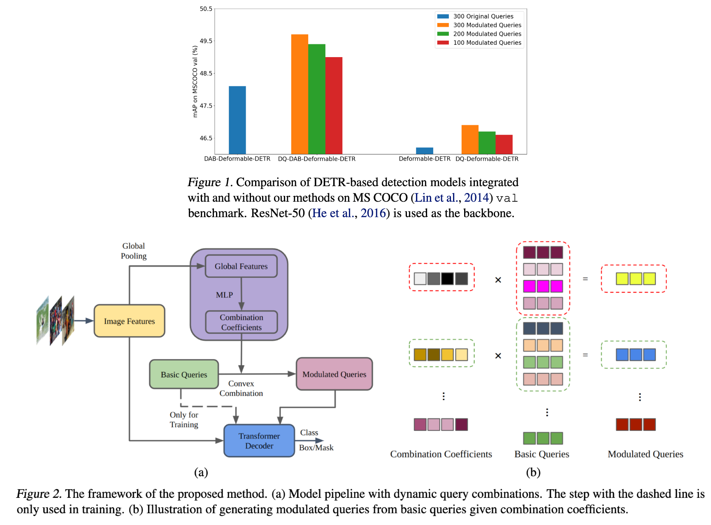

# Learning Dynamic Query Combinations for Transformer-based Object Detection and Segmentation

This repository is an official implementation of the paper [Learning Dynamic Query Combinations for Transformer-based Object Detection and Segmentation
](https://openreview.net/forum?id=FI5IysDR8pG).

## Introduction

<!--{width="800" style="display: block; margin: 0 auto" }-->
 

**Abstract.** Transformer-based detection and segmentation methods use a list of learned detection queries to retrieve information from the transformer network and learn to predict the location and category of one specific object from each query. We empirically find that random convex combinations of the learned queries are still good for the corresponding models. We then propose to learn a convex combination with dynamic coefficients based on the high-level semantics of the image. The generated dynamic queries, named modulated queries, better capture the prior of object locations and categories in the different images. Equipped with our modulated queries, a wide range of DETR-based models achieve consistent and superior performance across multiple tasks including object detection, instance segmentation, panoptic segmentation, and video instance segmentation.

## License

This project is released under the [Apache 2.0 license](./LICENSE).

## Usage

Please follow the instructions in each individual folder.
